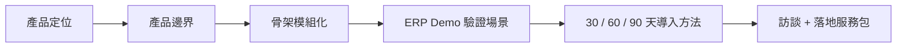

# Dodo Admin 戰略步驟與 3-6 週執行計畫

簽名：Codex GPT-5

建立日期：2026-06-27

## 目的

本文件先行歸檔目前針對 Dodo Admin 的產品討論結果，作為後續討論、產品邊界收斂與開發排程的基準。

## 1. 整體性的戰略步驟

| 階段 | 目標 |
|---|---|
| 產品定位 | Dodo Admin = `code-first`、`config-driven` 內部系統骨架 |
| 產品邊界 | 不做完整 `ERP / MES / No Code`，先做可落地後台 |
| 骨架模組 | `Dashboard`、`User Management`、`Role Permission`、`Data Tables`、`Forms`、`ERP Demo` |
| 驗證場景 | 先服務小型製造業 / 傳產內部營運工具 |
| 服務模式 | 訪談 → 盤點 → `30 / 60 / 90` 天落地 → 擴充 |

## 2. 當前程式碼位置

| 項目 | 目前狀態 |
|---|---|
| 產品定位頁 | 已完成：`docs/dodo-admin-positioning.html` |
| Git 狀態 | `master` ahead `14`，目前有 `.gitignore` 修改與新 HTML 文件 |
| 前端底座 | React、TanStack Router、TanStack Query、Tailwind、shadcn 類型元件 |
| 後端底座 | FastAPI、SQLModel、Alembic、users、items、menus、login |
| 已接近 Dodo Admin 的功能 | Dashboard 工作區、Admin 使用者管理、Sidebar、權限 / menu 基礎 |
| 尚未產品化 | Role Permission UI、Data Tables 模組化、Forms、ERP Demo 正式頁面 |

目前更精準地說：

> 程式碼仍是 Full Stack Template 延伸版，已經開始長出 Dodo Admin 的骨架，但還沒有完成 Dodo Admin 的產品化分層。

## 3. 後續 3-6 週執行計畫

| 週期 | 目標 | 產出 |
|---|---|---|
| 第 1 週 | 產品邊界固定 | `Dodo Admin MVP Scope` 文件 |
| 第 2 週 | 導覽與命名產品化 | Sidebar 從 template 語言改成 Dodo Admin 模組 |
| 第 3 週 | Data Tables 模組定義 | 通用 table pattern、範例資料、CRUD 展示 |
| 第 4 週 | Forms 模組雛形 | 表單頁、欄位設定範例、送出 / 驗證流程 |
| 第 5 週 | ERP Demo 情境頁 | 小型製造 / 傳產流程 Demo：訂單、工單或追蹤表 |
| 第 6 週 | 導入服務包 | 訪談問題、`30 / 60 / 90` 天提案頁、Demo 腳本 |

## 4. 下一步建議

下一步先做第 1 週的 `Dodo Admin MVP Scope` 文件，不立刻改功能。

原因是目前最重要的是把 Dodo Admin 的「做什麼 / 不做什麼」寫清楚，避免後續實作滑回完整 `ERP`、泛用模板或過度客製。

---

簽名：Codex GPT-5
