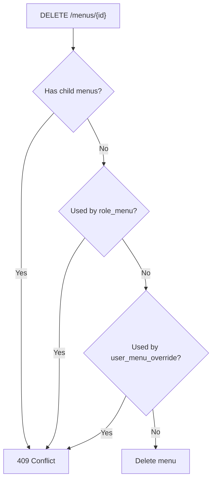

# Menu CRUD 管理功能計畫

AI-Model: Codex GPT-5

## 背景

目前資料表 `menu` 已存在，並已被後端 `GET /api/v1/menus/tree` 與前端 Sidebar 動態選單使用。這次目標是新增一套管理用 CRUD 功能，讓 superuser 可以透過前端 tab 管理 menu 資料。

本計畫不修改資料庫 schema，因此不需要 Alembic migration。

## 目標

- 補齊後端 `menu` 管理用 CRUD API。
- 前端新增 `Menus` 管理 tab。
- 使用 OpenAPI 自動產生 frontend SDK。
- 刪除 `menu` 前在 API 層檢查關聯資料，避免誤刪。

## 不包含

| 項目 | 原因 |
|---|---|
| Alembic migration | 不新增欄位、不修改 FK、不改 table schema |
| DB FK 調整 | 第一版只做 API 層防護 |
| Sidebar 自動刷新 | 先用 F5 重新讀取 Sidebar |
| Playwright 測試 | 本階段先忽略測試 |
| 修改既有 seed 資料 | 本次只做 CRUD 工具 |

## 預計影響檔案

| 類型 | 檔案 | 動作 |
|---|---|---|
| Backend model | `backend/app/models.py` | 新增 `MenuCreate`、`MenuUpdate`、`MenuPublic`、`MenusPublic` |
| Backend API | `backend/app/api/routes/menus.py` | 保留 `/menus/tree`，新增 CRUD endpoints |
| Frontend client | `frontend/openapi.json`、`frontend/src/client/*` | 由 OpenAPI 自動重新產生 |
| Frontend page | `frontend/src/components/Menus/` | 新增 CRUD UI 元件 |
| Tab 註冊 | `frontend/src/components/TabHeader/tabRegistry.tsx` | 新增 `menus` tab |
| Path 對應 | `frontend/src/components/Sidebar/tabKeyMap.ts` | 新增 `/system/menus -> menus` |

## 後端設計

| Method | Path | 用途 | 權限 |
|---|---|---|---|
| `GET` | `/api/v1/menus/` | 讀取管理頁列表 | superuser |
| `POST` | `/api/v1/menus/` | 新增 menu | superuser |
| `GET` | `/api/v1/menus/{id}` | 讀取單筆 menu | superuser |
| `PATCH` | `/api/v1/menus/{id}` | 更新 menu | superuser |
| `DELETE` | `/api/v1/menus/{id}` | 刪除 menu | superuser |

### 後端驗證邏輯

- `key` 必須唯一。
- `parent_id` 若有值，必須對應既有 menu。
- `parent_id` 不可指向自己。
- 更新 parent 時避免形成循環關係。
- 刪除前檢查關聯資料。

### Delete API 防護

刪除 `menu` 前，若存在以下任一關聯，回傳 `409 Conflict`：

| 檢查 | 原因 |
|---|---|
| 子選單 `menu.parent_id = id` | 避免 parent 被刪時連帶影響子選單 |
| `role_menu.menu_id = id` | 避免刪掉角色選單授權 |
| `user_menu_override.menu_id = id` | 避免刪掉使用者覆寫設定 |



## 前端設計

前端沿用現有 `ItemsView` / `AdminView` 模式，新增 `frontend/src/components/Menus/`：

| 檔案 | 職責 |
|---|---|
| `MenusView.tsx` | 管理頁主畫面，讀取列表並顯示表格 |
| `columns.tsx` | DataTable 欄位定義 |
| `AddMenu.tsx` | 新增 menu dialog |
| `EditMenu.tsx` | 編輯 menu dialog |
| `DeleteMenu.tsx` | 刪除確認 dialog |
| `MenuActionsMenu.tsx` | 每列操作選單 |

### 表單欄位

| 欄位 | 控制 | 驗證 |
|---|---|---|
| `key` | Input | 必填 |
| `label` | Input | 必填 |
| `path` | Input | 選填 |
| `parent_id` | Select | 選填，可選根選單 |
| `sort_order` | Number input | 預設 `0` |
| `icon` | Input | 選填，填 Lucide icon name |
| `is_active` | Checkbox | boolean |
| `is_visible` | Checkbox | boolean |

### Query 設計

| Query key | 用途 |
|---|---|
| `['menus']` | Menu 管理頁列表 |

CRUD mutation 成功後只刷新 `['menus']`。Sidebar 動態選單不自動刷新，使用者可用 F5 重新讀取。

## SDK 產生

後端 API 完成後，使用既有 OpenAPI 流程重新產生 frontend SDK。前端不手寫 `MenusService`。

預期產生並使用：

```ts
MenusService.readMenus()
MenusService.createMenu()
MenusService.readMenu()
MenusService.updateMenu()
MenusService.deleteMenu()
```

## 實作任務

- [x] 新增 `MenuCreate` / `MenuUpdate` / `MenuPublic` / `MenusPublic`
- [x] 新增 `GET /menus/`
- [x] 新增 `POST /menus/`
- [x] 新增 `GET /menus/{id}`
- [x] 新增 `PATCH /menus/{id}`
- [x] 新增 `DELETE /menus/{id}`
- [x] 實作 delete 前關聯檢查
- [x] 實作 parent 存在檢查與避免循環
- [x] 重新產生 frontend SDK
- [x] 新增 `frontend/src/components/Menus/`
- [x] 新增 `menus` tab registration
- [x] 新增 `/system/menus -> menus` path mapping

## 驗收項目

- [ ] superuser 可以開啟 `Menus` tab。
- [ ] Menu 管理頁可以讀取既有 menu 清單。
- [ ] 可以新增 root menu。
- [ ] 可以新增 child menu。
- [ ] 可以編輯 `label`、`path`、`parent_id`、`sort_order`、`icon`、`is_active`、`is_visible`。
- [ ] 重複 `key` 時 API 回傳錯誤，前端顯示錯誤。
- [ ] parent 指向自己或形成循環時 API 回傳錯誤。
- [ ] 有子選單時無法刪除 parent menu。
- [ ] 有 `role_menu` 關聯時無法刪除 menu。
- [ ] 有 `user_menu_override` 關聯時無法刪除 menu。
- [ ] 無關聯資料的 menu 可以刪除。
- [ ] 不需要新增或執行 Alembic migration。
