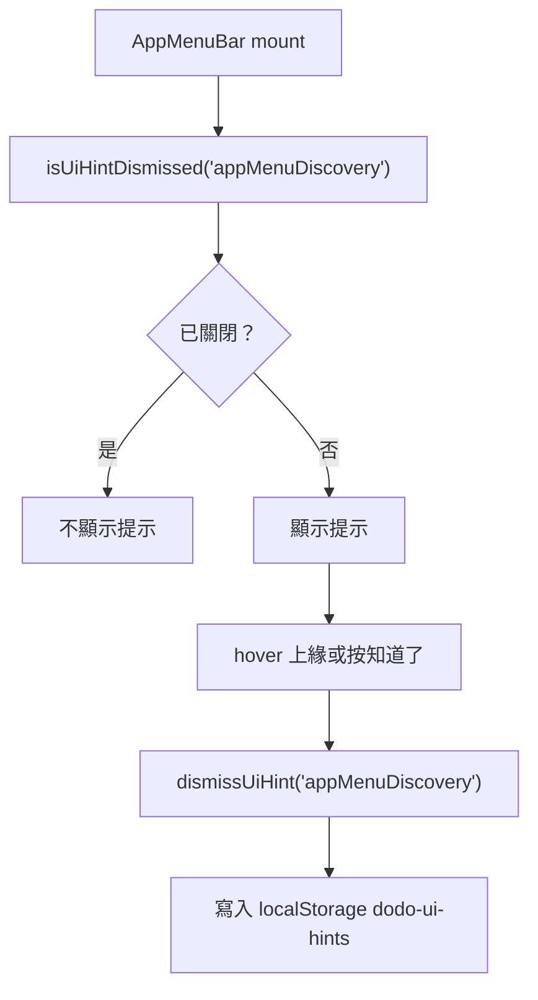

# UI 提醒狀態 Storage 管理計畫

## 目標

將 UI 提醒類狀態集中管理，避免每個元件各自直接操作 `localStorage`，讓未來新增提醒時有一致的儲存格式與 helper API。

## 背景

目前 `AppMenuBar` 的首次提示使用單一 key：

```text
dodo-app-menu-discovery-hint-dismissed
```

這種做法短期可行，但如果未來有 Sidebar、Footer、Toolbar 等提醒，`localStorage` key 會變得分散，不利於查找、清除與維護。

## 建議資料結構

使用單一分類 key：

```text
dodo-ui-hints
```

內容使用 JSON：

```json
{
  "appMenuDiscovery": {
    "dismissed": true,
    "dismissedAt": "2026-06-18T10:30:00.000Z"
  }
}
```

## 預計新增檔案

| 檔案 | 動作 | 說明 |
|---|---|---|
| `src/lib/ui-hints-storage.ts` | 新增 | 集中管理 UI hint 的 localStorage 讀寫 |
| `src/components/Header/AppMenuBar.tsx` | 修改 | 改用 helper，不再直接操作 `localStorage` |

## 建議 API

```ts
type UiHintId = "appMenuDiscovery"

function isUiHintDismissed(id: UiHintId): boolean
function dismissUiHint(id: UiHintId): void
function resetUiHint(id: UiHintId): void
```

## 使用流程



## 任務項目

- [ ] 新增 `src/lib/ui-hints-storage.ts`。
- [ ] 定義 `UiHintId` 與 `UiHintsState` 型別。
- [ ] 實作 `readUiHintsState()` 與 `writeUiHintsState()` 私有 helper。
- [ ] 實作 `isUiHintDismissed()`。
- [ ] 實作 `dismissUiHint()`，寫入 `dismissedAt`。
- [ ] 實作 `resetUiHint()`，方便開發測試。
- [ ] 將 `AppMenuBar.tsx` 改用 helper。
- [ ] 移除舊 key `dodo-app-menu-discovery-hint-dismissed` 的直接讀寫。

## 不做範圍

| 不做 | 原因 |
|---|---|
| 不導入全域狀態管理 | 這只是 localStorage helper，不需要 store |
| 不一次改所有未來提醒 | 目前只有 `appMenuDiscovery` |
| 不新增設定頁 | 使用者目前只需要提醒 dismiss 狀態 |

## 驗收方式

- `AppMenuBar` 首次提示仍能正常顯示。
- 點「知道了」或 hover 上緣後，提示不再出現。
- `localStorage["dodo-ui-hints"]` 可看到 `appMenuDiscovery.dismissed = true`。
- 清除該 key 後，重新整理會再次顯示提示。
