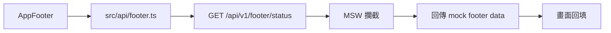

# Footer API Mock with MSW 計畫

## 目標

把目前寫死在 `AppFooter` 裡的 footer 資料，改成：



## 安裝套件

使用 Bun：

```bash
bun add -d msw
bunx msw init public --save
```

說明：

- `msw`：API mock 工具
- `public/mockServiceWorker.js`：MSW browser worker 檔案

官方參考：

- [MSW Introduction](https://mswjs.io/docs/)
- [MSW Browser integration](https://mswjs.io/docs/integrations/browser/)
- [setupWorker API](https://mswjs.io/docs/api/setup-worker/)

## 預計新增檔案

| 檔案 | 作用 |
|---|---|
| `src/api/footer.ts` | 手寫 footer API layer，不修改 generated SDK |
| `src/mocks/handlers.ts` | 定義 MSW mock API response |
| `src/mocks/browser.ts` | 建立 browser worker |
| `public/mockServiceWorker.js` | `msw init` 產生的 worker 檔 |

## 預計修改檔案

| 檔案 | 修改內容 |
|---|---|
| `package.json` | 新增 `msw` dev dependency |
| `src/main.tsx` | dev 模式啟動 MSW browser worker |
| `src/components/Footer/AppFooter.tsx` | 移除寫死資料，改用 API 資料 |
| `src/lib/dodo-controller.ts` | 若 footer state 型別要反映 API 資料，微調型別 |

## API Layer 設計

不修改：

```txt
src/client/
```

因為它是 OpenAPI generator 產物。

新增：

```txt
src/api/footer.ts
```

預計包含：

```ts
export type FooterStatus = {
  connectionStatus: '已連線'
  database: string
  company: string
  fiscalYear: number
  language: string
}

export function getFooterStatus(): Promise<FooterStatus>
```

未來後端真的提供 OpenAPI endpoint 後，
只改 `src/api/footer.ts` 內部實作即可。

## Mock API 設計

MSW handler 攔截：

```txt
GET /api/v1/footer/status
```

回傳：

```ts
{
  connectionStatus: '已連線',
  database: 'PROD-TPE-01',
  company: 'DoDo 台北總公司',
  fiscalYear: 2026,
  language: '繁體中文',
}
```

## AppFooter 調整

`AppFooter` 目前資料來源：

```ts
const footerStatus = { ... }
```

改成：

```ts
const { data: footerStatus } = useQuery({
  queryKey: ['footerStatus'],
  queryFn: getFooterStatus,
})
```

保留既有功能：

- 預設顯示
- `show()` / `hide()` / `toggle()`
- hover 喚回
- `window.dodo.controller.footer.getState()`

## 測試策略

此階段不設計測試情境、不執行測試。

進入「測試」階段時再確認：

- 是否只手動看畫面
- 是否新增 Playwright 測試
- 是否跑既有測試

## 風險與注意

| 風險 | 處理 |
|---|---|
| MSW 只應在 dev 啟動 | `main.tsx` 用 `import.meta.env.DEV` 包住 |
| generated SDK 被覆蓋 | 不修改 `src/client` |
| footer 載入中資料為空 | footer 可先顯示 fallback 或保留前一版預設值 |
| 未來接真後端 | 只替換 `src/api/footer.ts` |
